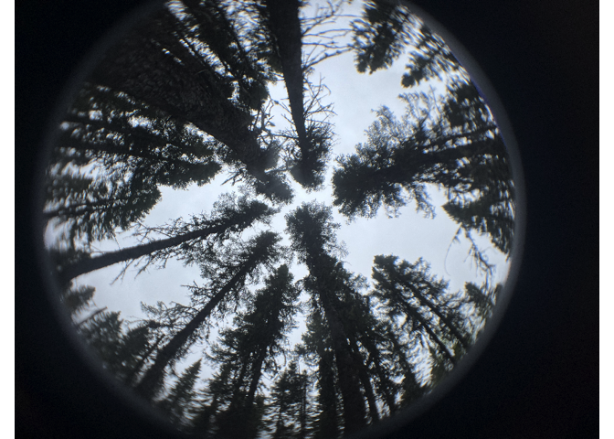
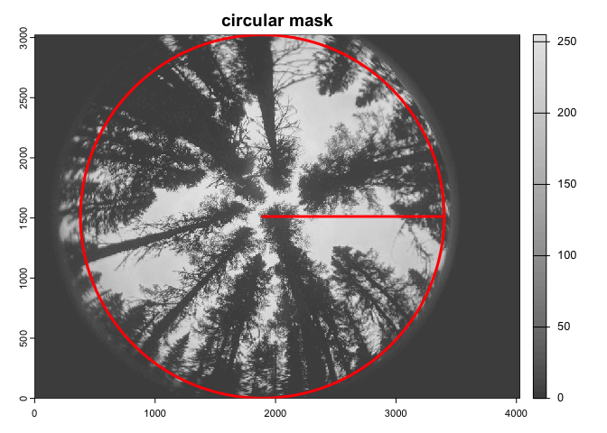
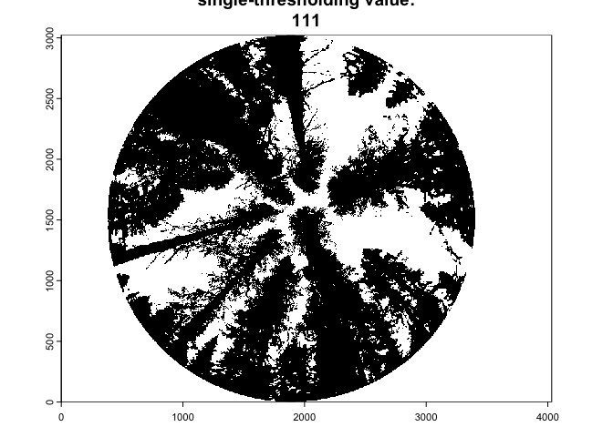
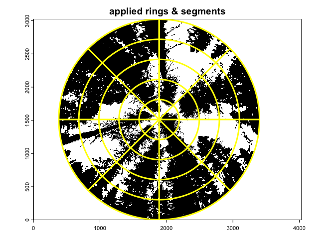

Canopy openess
================
https://github.com/cran/hemispheR

## House keeping

    # if you want, clear the workspace
    rm(list = ls())

    # set the working directory
    setwd("/Your/working/directory/here")

    # load useful library
    pacman::p_load(hemispheR, # For canopy fish-eye images processing
                   dplyr, # For grammar, data manipulation
                   terra, # For geographic (spatial) data manipulation
                   magick, # For image manipulation
                   exifr # For extracting metadata
                   )

    image_folder <- "NAME_OF_YOUR_FOLDER_CONTAINING_JPEG_IMAGES"

## Import Image

    image_file <- file.path(image_folder, "IMAGE1.jpg")
    # plot the raster image
    terra::plotRGB(terra::rast(image_file))

## Select metadata information (optional)

    xmp_data <- read_exif(image_file) %>%
      select(
        FileName,
        CreateDate,
        LensID,
        Megapixels,
        GPSLatitude,
        GPSLongitude,
        GPSAltitude
      )
    glimpse(xmp_data)
    # Rows: 1
    # Columns: 7
    # $ FileName     <chr> "README_FC2_Dicra.jp…
    # $ CreateDate   <chr> "2025:05:31 14:46:35"
    # $ LensID       <chr> "iPhone 13 back dual…
    # $ Megapixels   <dbl> 12.19277
    # $ GPSLatitude  <dbl> 48.52182
    # $ GPSLongitude <dbl> -79.43314
    # $ GPSAltitude  <dbl> 325.4988

## import\_fisheye

This function imports and prepares a fisheye image for further analysis
(e.g. binarization or canopy structure metrics). It crops and resizes
the image based on lens characteristics and user preferences.

    img<-import_fisheye(filename=image_file,
                        channel = 3,
                        circ.mask=list(xc=1890,yc=1512,rc=1510),
                        circular=TRUE,
                        gamma=2.2,
                        stretch=FALSE,
                        display=TRUE,
                        message=FALSE)

*filename*  
Character. The input image filename.

*channel*  
default = 3   
The blue channel (3 or “B”) has the highest contrast between sky and
vegetation. Vegetation reflects less blue light, while the sky appears
bright — making it easier to segment. This is the standard choice in
hemispherical image analysis (especially in gap fraction estimation).

*circ.mask*  
List. If missing, they are automatically calculated (corresponds to half
the lower image side);  
The circular mask parameters (xc,yc,rc) to be applied to the image. The
(x,y) coordinate of the center and radius (in pixels).

*circular*  
It allows to specify if the fisheye image is circular (circular=TRUE) or
fullframe (circular=FALSE).

*gamma*  
default = 2.2   
Gamma correction is a nonlinear operation that adjusts image brightness.
Most images (especially JPEGs) are saved with gamma encoding (~2.2) to
match how human eyes perceive light (human vision is more sensitive to
low light). To accurately analyze light intensity (e.g., canopy
openness, gap fraction), you need to undo this compression. Use gamma =
1 when working with raw format (e.g., DNG).

*Stretch*  
default = FALSE   
Contrast stretching is a **relative, image-specific adjustment**. It
linearly rescales pixel intensities so that the darkest and brightest
values are spread across the full range (e.g., 0–255). This enhances
contrast within each image, but it alters the absolute pixel values, so
images no longer reflect true differences in light or exposure between
photos. So, if you’re comparing metrics like gap fraction, canopy
openness, or LAI across multiple images, using stretch = TRUE may
distort those differences.

*display*  
default = FALSE   
if TRUE, it plots the image along with the applied mask and a circle
radius.

*message*  
default = TRUE   
If is set to TRUE, it prints the mask used for importing the image.

## binarize\_fisheye

This function converts a hemispherical (fisheye) image to a binary
image, typically for estimating canopy openness or light penetration.
Several thresholding methods can be used.

    img.bw <- binarize_fisheye(img,
                                 method = 'Otsu',
                                 zonal = FALSE,
                                 manual = NULL,
                                 display = TRUE,
                                 export = FALSE)

  
    
*img*   
A single layer fisheye image imported by import_fisheye()    
  
*method*  
Default = ‘Otsu’   
**Thresholding methods** are techniques used in image binarization,
where the goal is to separate foreground from background — by converting
a grayscale image into a binary one (black and white). The available
methods are described at <https://imagej.net/plugins/auto-threshold>

*zonal*  
Default = FALSE   
If TRUE, applies thresholding separately within defined zenith zones (N,
W, S, E). Useful for zonal analysis of canopy structure.

*manual*  
Default = NULL   
Manually set a threshold value (e.g., 0.35). Overrides the method
parameter if not NULL.

*display*  
Default = FALSE   
If is set to TRUE, it plots the classified binary image.

*export*  
Default = FALSE   
If is set to TRUE, it saves the binary fisheye image as tif file.

## gapfrac\_fisheye

This function calculates **gap fraction (the proportion of visible
sky)** from a binarized fisheye image. It divides the image into zenith
rings and azimuthal segments to estimate light penetration.

    gapfrac <- gapfrac_fisheye(img.bw,
                                maxVZA = 90,
                                lens = "equidistant",
                                startVZA = 0,
                                endVZA = 90,
                                nrings = 5,
                                nseg = 8,
                                display = TRUE,
                                message = TRUE)

  
*img.bw*     
A single layer binarized fisheye image imported by binarize_fisheye() 

*maxVZA*  
DEFAULT = 90  
A zenith angle of 90° corresponds to the horizon — the outer edge of the
image.

*lens*  
DEFAULT = “equidistant” Lens projection type. Use “equidistant” for most
fisheye lenses; other options available by typing *list.lensens*

*startVZA*  
DEFAULT = 0  
Starting zenith angle (in degrees). Often 0°, the image center.

*endVZA*  
DEFAULT = 70  
It defines how far from the center (zenith = 0°) toward the edge of the
fisheye image you’re including in calculations. Setting it to 70°
excludes the last 20° of the imagehe because the outermost area often
contains lens distortion, vignetting, obstructions.

*nrings*  
DEFAULT = 7  
Number of zenith rings (concentric circles) used to divide the image
vertically. when you’re dividing a fisheye image into zenith rings,
you’re analyzing concentric circles that represent slices of the sky
from overhead (0°) down to the horizon (90°), which helps in estimating
how much light gets through at different angles.

*nseg*  
DEFAULT = 8  
Number of azimuthal segments (like pie slices) used to divide the image
horizontally - compass directions measured in degrees along the horizon.

*message*  
DEFAULT= FALSE  
If set to TRUE, prints progress and summary messages.

*display*  
DEFAULT = FALSE  
If set to TRUE, displays the ring and segment layout on the image.

## canopy\_fisheye

    canopy_report <- canopy_fisheye(rdfw = gapfrac) %>%
      rename(PhotoID = id) # to match excel datasheet
    glimpse(canopy_report)
    # Rows: 1
    # Columns: 20
    # $ PhotoID  <chr> "README_FC2_Dicra.jpg"
    # $ Le       <dbl> 0.96
    # $ L        <dbl> 1.14
    # $ LX       <dbl> 0.84
    # $ LXG1     <dbl> 0.58
    # $ LXG2     <dbl> 0.44
    # $ DIFN     <dbl> 39.094
    # $ MTA.ell  <dbl> 14
    # $ x        <dbl> 5.43
    # $ VZA      <chr> "9_27_45_63_81"
    # $ rings    <int> 5
    # $ azimuths <int> 8
    # $ mask     <chr> "1890_1512_1510"
    # $ lens     <chr> "equidistant"
    # $ channel  <chr> "3"
    # $ stretch  <chr> "FALSE"
    # $ gamma    <chr> "2.2"
    # $ zonal    <chr> "FALSE"
    # $ method   <chr> "Otsu"
    # $ thd      <chr> "111"

*rdfw*  
Dataframe. The input dataframe generated from gapfrac\_fisheye(), which
contains gap fraction for zenith and azimuth bins.

### Site Comparison

**DIFN (Diffuse Non-Interceptance)** What it measures: Percentage of sky
visible through canopy gaps (direct proxy for light penetration). Range:
0% (fully closed canopy) to 100% (open sky). Best for: Overall light
availability under the canopy.

### Temporal Trends

**LX (Light Transmission Index)** What it measures: Fraction of
potential light reaching the forest floor. Range: 0 (no light) to 1
(full light). Best for: Comparing relative light levels between
sites/dates.

### Spatial Light Gradients

**LXG1/LXG2 (Light Gradient Zones)** What it measures: Light
transmission in specific angular zones (e.g., LXG1 = zenith light, LXG2
= oblique angles). Best for: Analyzing directional light patterns (e.g.,
sunflecks vs. diffuse light).
